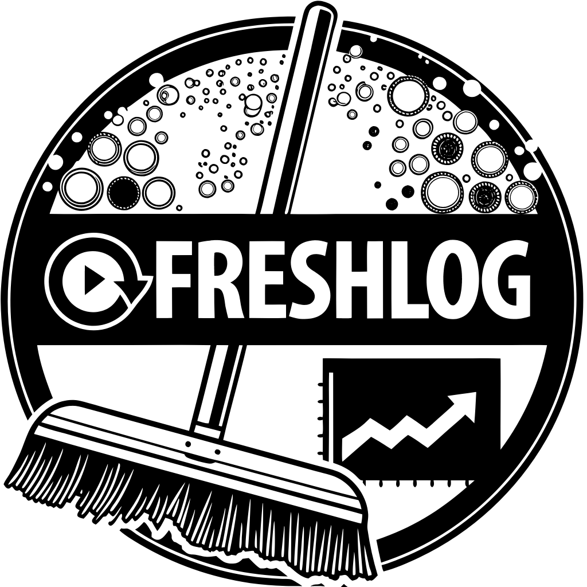

# FreshLog



FreshLog is an application designed for restroom cleaning management. It allows tracking cleaning times, sending daily reports via email, and managing cleaning staff and schedules efficiently.

---

## Features

### Visitor Role:
- View the most recent cleaning logs.

### Operator Role:
- Access the Operator Panel.
- Log cleaning times with a single button press, recording the operator's name and timestamp.

### Admin Role:
- Manage cleaning staff: add, remove, or promote them to admin.
- Set operator access passwords.
- Add or remove email addresses for daily report distribution.
- Configure schedules:
  - Set the daily report sending time.
  - Define opening and closing hours to ensure reports include data only within those times.

---

## Requirements

- **PHP** >= 8.2
- **Composer** for dependency management
- **MySQL** or any compatible database
- A web server such as **Apache** or **Nginx**

---

## Installation

1. Clone the repository:
   ```bash
   git clone https://github.com/Trollkopf/FreshLog.git
   cd FreshLog
   ```

2. Install dependencies:
   ```bash
   composer install
   ```

3. Set up your `.env` file:
   - Copy the `.env.example` file and rename it to `.env`.
   - Configure the database, mail settings, and other necessary environment variables.

4. Run migrations to set up the database:
   ```bash
   php artisan migrate
   ```

5. Serve the application:
   ```bash
   php artisan serve
   ```

6. Access the app at `http://localhost:8000`.

---

## Daily Report Email Configuration

- Reports include cleaning data within the defined opening and closing hours.
- Emails are sent to the addresses specified in the Admin Panel.
- The sending time can be configured in the Admin Panel.

---

## Contributing

Feel free to submit pull requests or issues for improvement. Connect with the developer:

- **GitHub**: [Trollkopf](https://github.com/Trollkopf)
- **LinkedIn**: [Maximiliano Serratosa](https://www.linkedin.com/in/maximiliano-serratosa-obladen-full-stack-developer/)

---

## License

This project is licensed under the MIT License. See the `LICENSE` file for details.

---

Developed with ❤️ by Max Serratosa.
